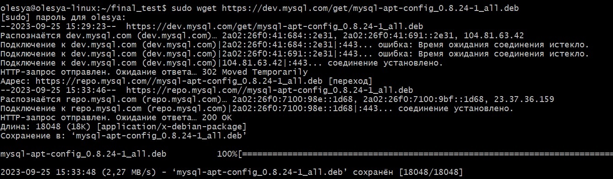

1. Используя команду cat в терминале операционной системы Linux, создать два файла Домашние животные (заполнив файл собаками, кошками, хомяками) и Вьючные животными заполнив файл Лошадьми, верблюдами и ослы, а затем объединить их. Просмотреть содержимое созданного файла. Переименовать файл, дав ему новое имя (Друзья человека).

2. Создать директорию, переместить файл туда.

3. Подключить дополнительный репозиторий MySQL. Установить любой пакет из этого репозитория.

Скачиваем конфигуратор mysql:

устанавливаем компоненты mysql:

Обновляем информацию о пакетах и устанавливаем mysql-server:

4. Установить и удалить deb-пакет с помощью dpkg

5. Выложить историю команд в терминале ubuntu
